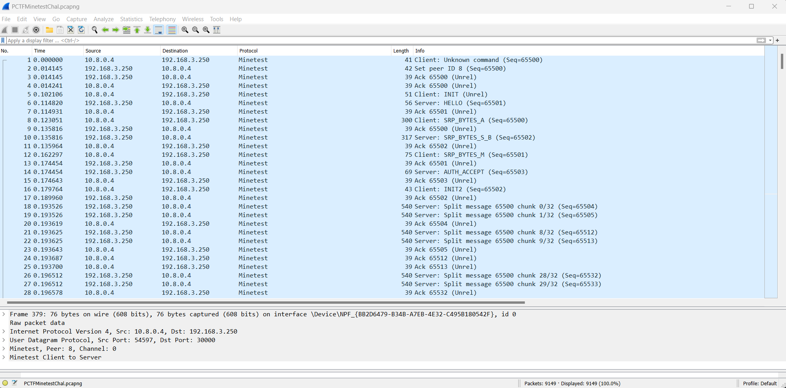
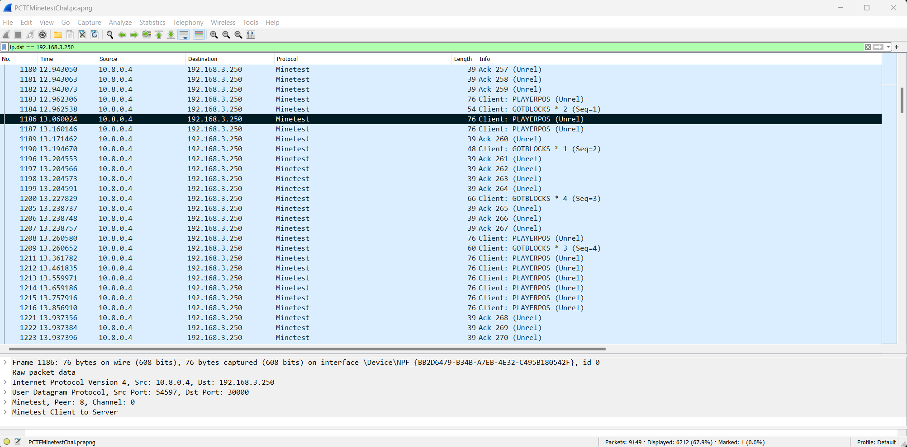
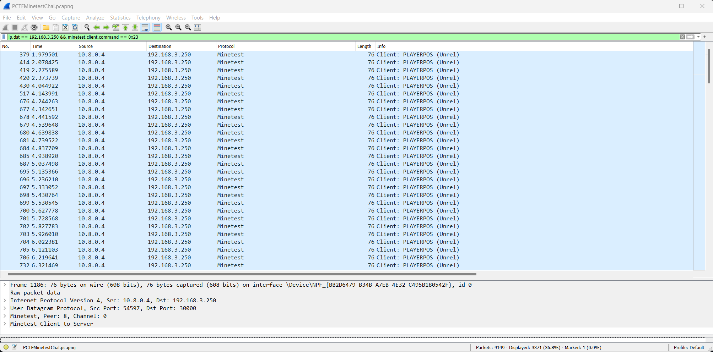
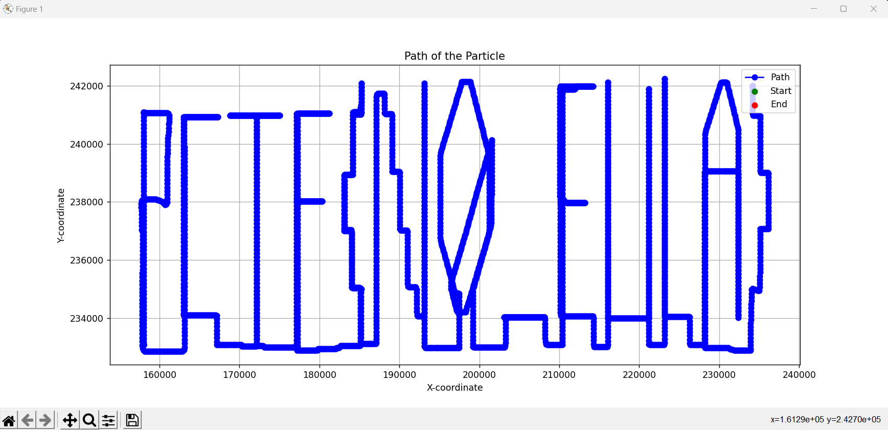

# Read The EULA
My friend and I use to play Minecraft all the time together, but with recent updates he went off on some tangent about something called a Eula or something like that. Anyways, he said he found a new mining game he was *test*ing but wouldn't tell me the name of it. All he sent was a PCAP of him playing the game, saying he hid a flag in his movement... whatever that means.

## Difficulty: 5/10
## Flag: PCTF{N0_EULA}
## Hints:
- PCAP Is traffic from Minetest
- Try looking to see if there are plugins that can parse the packets
## Matthew Johnson #meatball5201
## Tester: ChatGPT (this isn't a joke, chatgpt with code interpreter was able to solve this challenge if you export the packets to json)
## Write Up Time
The goal for this challenge is to figure out the exact path the player took in the game Minetest using the network traffic. To start, open the PCAP in wireshark, with the [Minetest packet dissector lua script](https://github.com/minetest/minetest/blob/master/util/wireshark/minetest.lua) installed.

Once open in wireshark, you'll see all the traffic going between the server and the game client. Start by filtering only the traffic the client is sending to the server using the filter `ip.dst == 192.168.3.250`.

You'll see that in the packets send to the server, there are several with the designation `CLIENT: PLAYERPOS`. These are the packets containing the player movements so update your filter to only include them. `ip.dst == 192.168.3.250 && minetest.client.command == 0x23`

From here there are a couple options, the easiest of which is probably to export the packets as JSON, and plot the path using python. Export the packets with packet dissections by going to **File -> Export Packet Dissections -> JSON** and ensuring that you select "Visible Packets".
All thats needed after that is to write some simple python code to read in the JSON file, iterate over each packet, grab the player position field, then plot it on a graph. Such a file is given as example in plot_path.py
When the program finished running, it will display the path the player took in game, spelling out the flag `PCTF{N0_EULA}`

