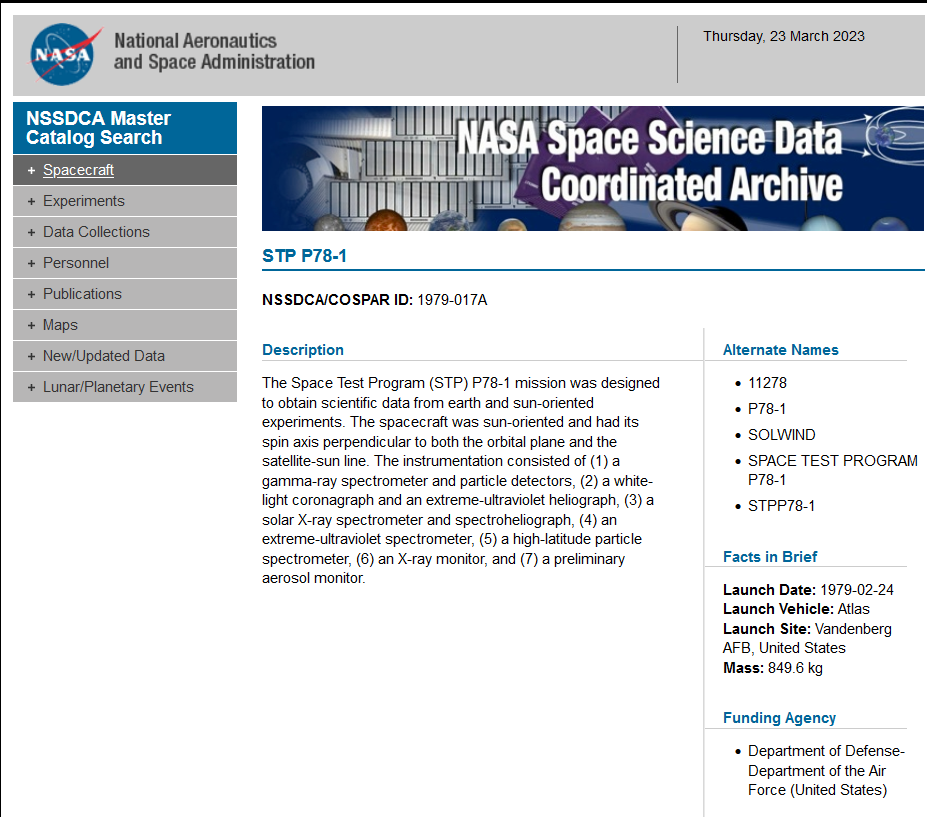
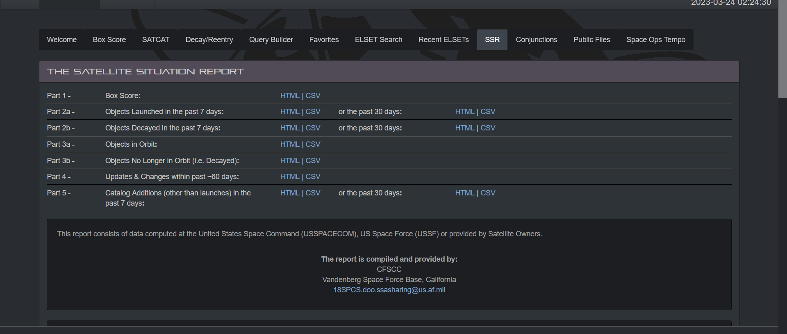
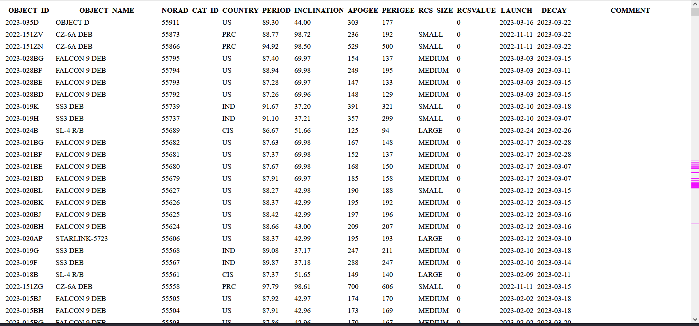
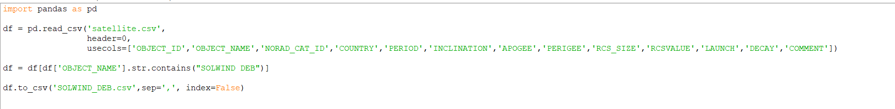
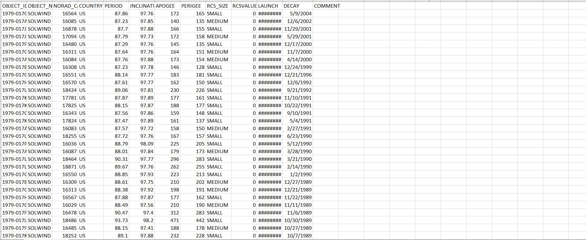

# Satellite Killer

### Description

Most satellites get to live out a relatively peaceful existence in space until their orbit eventually decays and they fall back to Earth.

Most.

Back in the 80's, one poor satellite met a premature end at the hands of an ASM-135.

I would like you to find the date that the second-to-last piece of its debris fell back down to Earth (Or more realistically, its decay date).

In addition, please give me its object ID/International Code.

Flag format:
PCTF{OBJECTID_YEAR-MONTH-DAY}
For example, for a piece of debris from the Falcon 9, the flag would look like this:
PCTF{2023-028BG_2023-3-15}

### Difficulty
7/10 (Hard)

### Flag
PCTF{1979-017AN_2002-06-12}
PCTF{1979-017AN_2002-6-12}

### Hints
There was a lot of debris. I would recommend automating this.

### Author
Migyaksuil (Maxime Bonnaud)

### Tester
None yet

### Learning objective
OSINT isn't just one big game of GeoGuessr, in fact, the most useful OSINT usually comes from analyzing large amounts of publicaly available information. This challenge is meant to be an introduction to that. There are quite a few databases that have this information, and once you have it, all you need to do is sort by the dates they deorbited and submit the second-to-last one. 

### Writeup

Using google to search for data about the satellite will quickly net you the information that it is the P78-1. I'll refer to it as SOLWIND from now on.

We now need to acquire infomation about objects in orbit (or in our case objects that have now left orbit). Thankfully, unlike shipping or flight databases, data on satellites is available for free and going back several decades.
I managed to download a CSV file with a list of decayed objects (since all debris has now fallen back to earth) that I will use for processing.

Looking through this list, we can see that debris is given its own identifier and decay date, perfect for our purposes!

I used a quick Python Pandas script to only get SOLWINDS debris data and write that to a new file 

Sorting by date wasn't working in Pandas, so I used excel instead.

We can see that the second-to-latest a piece of SOLWIND fell back to Earth was 2002-06-12
