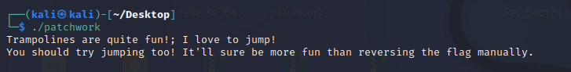
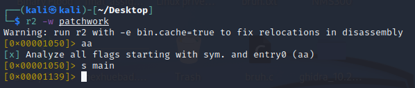
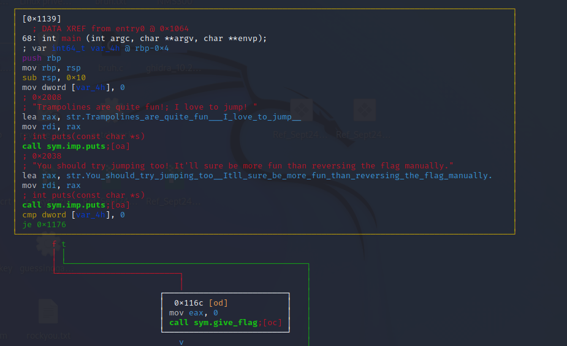
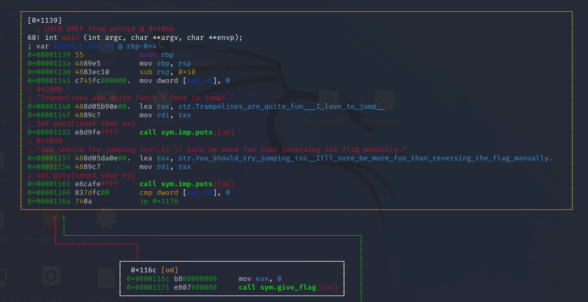
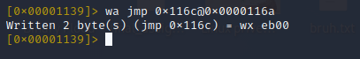
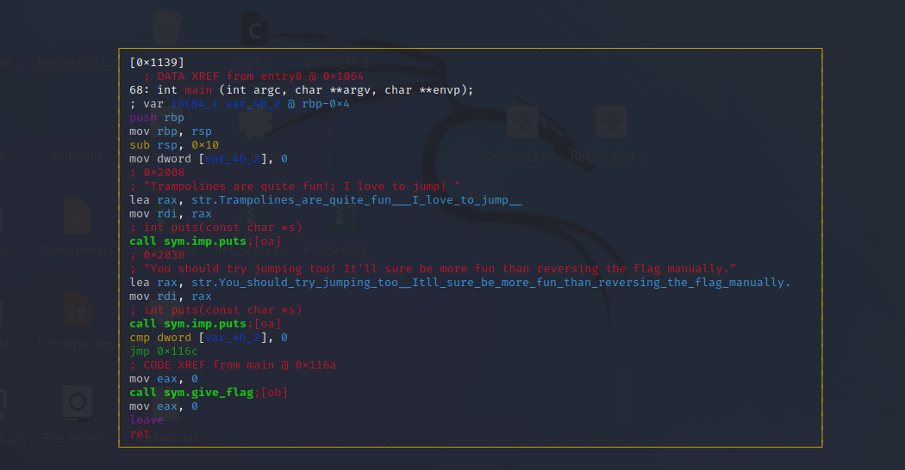
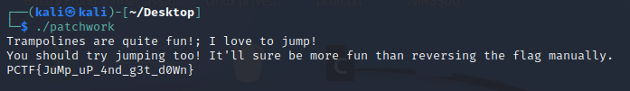

# Patchwork

### Description

This program should just give the flag, but I set the wrong value in the code and now it refuses to jump to the correct function. Could you patch it for me?

Flag Format: PCTF{}

### Difficulty
3/10 (Very Easy)

### Flag
PCTF{JuMp_uP_4nd_g3t_d0Wn}

### Hints
Try opening this up in radare2 and looking at the graph view. There is a specific function you want to jump to. When you find it, write some new assembly code!

### Author
Migyaksuil (Maxime Bonnaud)

### Tester
None yet

### Writeup

To begin, we can just run the binary and see what happens:

We are hinted that we should try jumping to a different function.

Opening this up in r2 (in write mode so that we can patch)
Run aa to do basic analsis and use "s main" to jump into the main function

Using the VV command, we can look at the graph view:
We see that a jump to a give_flag (I'm not very subtle) function will not happen since 0 is being compared with 0.

We can use P to see the addresses

Exiting out of this view, we can then write a new command which will always jump to our desired give_flag function

Looking at the graph view again, we can see that we will now go to the give_flag function no matter what

We can now run the binary and simply be given the flag

